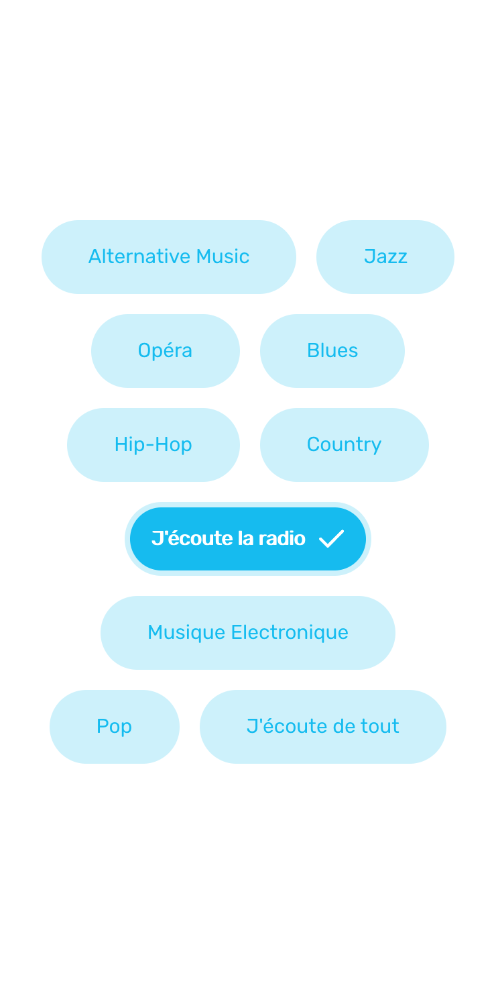
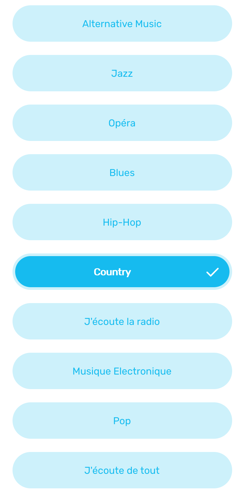

<h1 align="center">Ulys-Options</h1>

> *Ulys-Options for Angular 7 and Ionic 4*


# Overview

>**A custom Angular component allowing to simulate the behavior of `HTML` radio buttons without using them.**

* [Install](#install)
* [Usage](#usage)
* [Properties](#properties)
* [Captures](#captures)

## <a id="install"></a>Install

No install needed ! Just add the folder ```ulys-options/``` into your project folder

## <a id="usage"></a>Usage

Add ```UlysOptionsComponent``` to your module's ```declarations```

```typescript
import { NgModule } from '@angular/core';
import { BrowserModule } from '@angular/platform-browser';
import { AppComponent } from './app.component';

import { UlysOptionsComponent } from 'path-of-{ulys-options.component}';

@NgModule({
  imports: [BrowserModule, UlysOptionsComponent],
  declarations: [AppComponent],
  bootstrap: [AppComponent]
})

class AppModule {}
```

And then use it in your component (or in your page if you use Ionic)

```typescript
import { Component } from '@angular/core';

@Component({
    selector: 'app-example',
    template: `
        <ulys-options
                [options]="optionList"
                [defaultCheckedID]="4"
                large
                (check)="callBackFunction($event)">
        </ulys-options>
  `
})
export class AppComponent {
  
  optionList: IOption[] = [
    {
      id: 1,
      label: `First Option`
    },
    {
      id: 2,
      label: `Second Option`
    },
    {
      id: 3,
      label: `Third Option`
    },
    {
      id: 4,
      label: `Fourth Option`
    }
  ];

  constructor() { }

  callBackFunction(checkedOption: IOption) {
    console.log('Get the checked option object', checkedOption);
  }

}
```

## <a id="properties"></a>Properties

* [[options]](#options)
* [[defaultCheckedID]](#default-checked-id)
* [large](#large)
* [(check)](#check)

### <a id="options"></a>[options]

| Property | Type | Category | Required |
| -------- | ---- | -------- | -------- |
| `[options]` | `IOptions[]` | Input | Yes |

An array of `IOptions` containing the properties of an `ulys-options`.\
`IOptions` is a an object containing two properties: `id` and `label`.

```typescript
{
    id: any,
    label: string
}
```


### <a id="default-checked-id"></a>[defaultCheckedID]

| Property | Type | Category | Required |
| -------- | ---- | -------- | -------- |
| `[defaultCheckedID]` | `any` | Input | No |

This property is optional and allows to check by default an option. Its value type must be the same given to `id` in the `IOptions` array.

### <a id="large"></a>large

| Property | Type | Category | Required |
| -------- | ---- | -------- | -------- |
| `large` | -- | Input | No |

This property does not take any value. It allows to enlarge the size of the options

### <a id="check"></a>(check)

| Property | Type | Category | Required |
| -------- | ---- | -------- | -------- |
| `(check)` | `callback` | Output | No |

Occurs when checking an option. It allows also to get the checked option properties with callback

First define callback function "callBackFunction" in your controller,

```typescript
callBackFunction(checkedOption: IOption) {
   // Do anything with "checkedOption"
}
```

And then use it in your template:
```html
<ulys-options [...] (check)="callBackFunction($event)"></ulys-options>
```


## <a id="captures"></a>Captures

An example without `large` option



An example with `large` option



